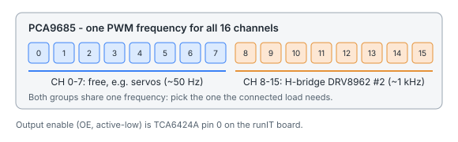

<!-- Generated by data-structures/auto-annotations/device/generate-devices.py from components/devices/device_pca9685/device_pca9685.md - do not edit. -->

# PCA9685 PWM expander

Sixteen PWM outputs over I2C, for servos, LEDs, motor drivers and other loads that need a PWM signal. 12-bit resolution, own oscillator.

## Before you use it

- **One frequency for all 16 channels.** Setting the PWM frequency on one channel changes it for every channel of the chip. Loads that need different frequencies (servos about 50 Hz, motor drivers about 1 kHz) can't run at their natural rates on the same chip: use a second PCA9685 for them.
- **Output enable is active-low.** With an OE pin configured, the outputs only drive while that pin is low. The pin belongs to the device: other commands can't read or change it.
- **No pin modes.** Every channel is an output: *Configure pin mode* is not a command of this device. Use *Set output level* for on/off and *Set PWM duty* for anything in between.

## Power and signals

| What | Value |
|---|---|
| Supply voltage (VDD) | 2.3 – 5.5 V; the PWM outputs swing between 0 V and VDD |
| Output current per channel | up to 25 mA sink, 10 mA source: drive larger loads (motors, LED strips, servo power) through a driver or from their own supply |
| I2C | 3.3 V logic works; the I2C lines are 5 V tolerant |
| Servo power | The chip only gives the signal: feed the servos from a separate supply with a common ground |

## Limits

| What | Value |
|---|---|
| PWM frequency | 24 – 1526 Hz (outside is refused) |
| Duty | 0 – 4095 ticks (higher is clamped) |
| Channels | 0 – 15 |

## Install

- **I2C bus** and **address** 0x40–0x77 except 0x70. The A0–A5 straps on the chip set the address; 0x70 is All Call and 0x78–0x7F are reserved.
- **Output enable pin**: optional. Leave *Not connected* when the chip's OE pin is tied low (outputs always on).

## Typical steps

1. *Set PWM frequency* on any channel (e.g. 50 Hz for servos).
2. *Set PWM duty* per channel.
3. Put both in an action to set a pose in one go.
