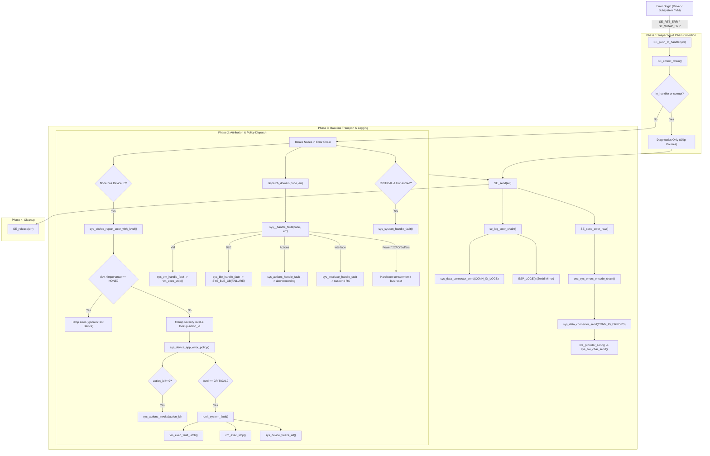
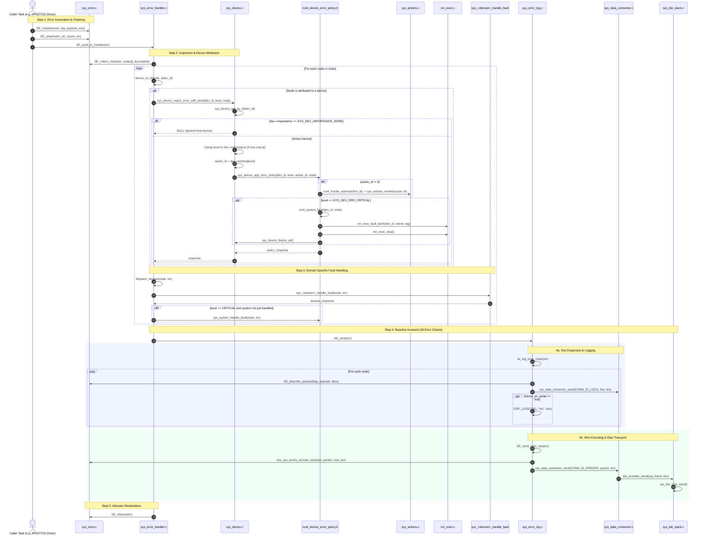

# System errors

Update this document when changing the error core, dispatcher, or tag maps.

## Pipeline and ownership

Errors are typed nodes linked through `next_cause`. `NULL` means success.
`SE_ERR_NEW` creates an owned node; `SE_WRAP_ERR` transfers ownership of its cause
into the new chain. Explicit-owner variants use the same allocator/constructors.
Do not share a cause between two owned chains.

```text
create -> wrap while returning -> SE_ORIGIN_CALL / SE_push_to_handler
       -> validate -> outermost node through causes -> diagnostics -> release
```

`SE_push_to_handler` is synchronous and **consumes** its argument, including when
reporting is suspended. Do not inspect, return, or release that handle afterwards.
`SE_send`, the encoder, logging functions, and policy hooks **borrow** their input.
They do not retain it. Their non-NULL return is a separate owned failure.
Use `SE_release(error)` after inspecting/discarding an error yourself.
`SE_IS_OK` / `SE_IS_ERR` only compare; they do not release an error.

```c
err_h error = operation();
if (error) {
  SE_release(SE_send(error)); // diagnostics only; release an encoding failure
  SE_release(error);         // or return error to transfer ownership to caller
}
// At an origin with no further use of the error:
SE_ORIGIN_CALL(operation());
```

## Storage and validation

The shared pool is 1,024 bytes: 32 blocks of 32 bytes, reserved with a 32-bit atomic
bitmap. A node occupies consecutive blocks. A 32-byte start-length table validates
node boundaries and complete tag-sized payloads. Tracking costs 36 bytes. There is
no heap allocation and live nodes are never overwritten. Payloads and nodes remain
8-byte aligned. Maximum concurrent capacity depends on payload sizes (up to 32
small nodes); synchronous handling does not eliminate overlapping producer tasks.

`SE_alloc_bytes` validates tag and exact payload size and returns NULL on exhaustion.
Prefer the constructors: a failed new error returns an immutable `ERR_BASE_NO_MEM`
node; a failed wrap preserves its existing cause, omitting the new context. Never
mutate the exhaustion node. Long-lived errors consume pool capacity until released.
The pool can exhaust without corrupting another chain; it does not guarantee that
all context can be retained during an error storm.

`SE_collect_chain` returns at most `SE_MAX_CHAIN_DEPTH` (16) unique validated nodes,
outermost first, plus a completeness flag. Handler, logger, encoder and root lookup
share this traversal. Cycles, invalid pointers and longer chains terminate safely.
Malformed/incomplete chains are diagnostic-only. `SE_release` frees the complete
pool-backed chain (also beyond the traversal limit) with bounded cycle detection.
Raw pointers are not generation handles: using a handle after consumption/release
remains invalid, even if its address is later allocated again.

## Dispatch policy

- Device attribution uses the tag payload, independently of the reporting owner.
  Device tags, IO pin tags and power-budget tags identify device instances.
  Contract boundaries wrap failures with the affected device ID.
- Visit outermost node to root cause. For a repeated device, use the highest local
  severity among its mentions before the first ignored-device boundary. Run that
  device's policy once, at its first occurrence; pass the node supplying that level.
  The leaf does not silently replace another node's severity.
- Importance NONE stops handling that device and all deeper causes. Earlier
  responses remain in effect; the full chain still goes to diagnostics. To suppress
  an entire incident, the ignored-device context must precede any actionable nodes.
- Noncritical response levels are capped by importance. Critical bypasses that cap
  for enabled devices; NONE still disables it. Tag severities themselves are unchanged.
- Domain hooks receive `(node, full_chain)` for each visited node in that domain.
  Unimplemented weak hooks are optional. `sys_error_hooks.h` is the dispatcher's
  single optional-hook declaration header; map headers only describe errors/owners.
- Unattributed critical errors (where no device in the chain was attributed,
  `handled == 0`) use `sys_system_handle_fault`, never a lookup of device zero.
  The application latches the triggering node and performs global stop/freeze
  once per latch episode. Enabled devices still run their individual actions
  after the global latch has been set. The dispatcher deduplicates devices
  per incident, not across separate incidents.
- Response failures are diagnostics-only and released after sending. A per-task
  handler guard prevents callbacks/actions re-entering policy while handling an
  incident. Hooks must return new owned failures, never the borrowed input chain.

`SE_suspend` / `SE_resume` are nested and task-local. Suppression in one task does
not drop unrelated errors from another task. The synchronous dispatch/logging API
is for task context; it can invoke actions, transport callbacks and VM barriers.

## Logging and telemetry

`SE_set_logging(level, mirror_serial, trace_errors)` controls text logging and the
ESP log interceptor. Text goes to connector 0 and optionally serial. Binary errors
go to connector 1 independently of text tracing. Connector configuration owns
framing, binding and capacity. The disconnected `sys_error_config` API was removed.
`SE_send` does not acknowledge delivery: transport providers have a void send API.
Its returned error describes encoding failure. Log recursion guards are task-local.

The binary format is version **2**:

```text
u8 version=2 | u8 node_count | u8 depth | u32 schema_id LE
repeated: u8 payload_length | u16 tag LE | u16 owner LE | payload bytes
```

`depth > node_count` indicates packet-capacity truncation. Depth 255 means corrupt
or over-depth input (the exact length is unknown). The schema ID is FNV-1a over
ordered NUL-terminated tag names and payload sizes (size XORed once per tag).
It detects reordered/added tags and payload-size changes. A same-size payload-layout
change still requires a format version change. Payloads retain native C alignment
and padding; scalar record headers are explicitly little endian.

The web stream decoder accepts v1 and v2. Its legacy typed tag table applies only
to v1; v2 packets retain IDs, owners, payload bytes and schema ID without applying
an unverified old tag table. Formatted logs still supply human-readable descriptions.
Clients with a matching schema may decode typed payloads.

## Files and verification

- `sys_error.c`: pool, release, bounded traversal, metadata.
- `sys_error_handler.c`: synchronous policy dispatch.
- `sys_error_log.c`: ESP logging hook, formatting, connector send.
- `include/sys_error.h`: constructors and ownership API.
- `include/sys_error_hooks.h`: optional domain hooks.
- `codes/sys_error_codes.h`: aggregate module tag/owner/logger maps.

`python tools/tests/test_sys_errors.py` exercises real core, dispatcher, encoder,
device manager and application policy with host substitutes for hardware/VM/actions.
It needs Zig and Node; see the script for a local toolchain installation. Firmware
selftests also release intentionally discarded errors and test device policy/encoding.
Host tests do not substitute for hardware scheduling/transport tests.

## Error Lifecycle & Call Tree Architecture

### 1. High-Level Flowchart



### 2. Detailed Sequence & Call Tree Diagram



### 3. Component Symbol & Call Reference Map

| Component / Step | Source File | Key Symbols / Functions |
| :--- | :--- | :--- |
| **Error Allocation & Chaining** | `sys_error.c` | `SE_create()`, `SE_wrap()`, `SE_collect_chain()`, `SE_release()` |
| **Handler & Central Dispatch** | `sys_error_handler.c` | `SE_push_to_handler()`, `device_id_of()`, `dispatch_domain()` |
| **Device Error Routing** | `components/system/sys_device/sys_device.c` | `sys_device_report_error_with_level()`, `sys_device_report_error()`, `sys_device_freeze_all()` |
| **App Coordinator Policy** | `components/runit/runit_device_error_policy.h` | `sys_device_app_error_policy()`, `runit_system_fault()`, `runit_invoke_action()` |
| **Action Execution** | `components/system/sys_actions/sys_actions.c` | `sys_actions_invoke()` |
| **VM Fault Containment** | `components/VM/core/exec/vm_exec.c` | `vm_exec_fault_latch()`, `vm_exec_stop()`, `sys_vm_handle_fault()` |
| **Logging & Wire Telemetry** | `sys_error_log.c` | `SE_send()`, `se_log_error_chain()`, `SE_send_error_raw()` |
| **Bus Switchboard** | `components/system/sys_data_connector/sys_data_connector.c` | `sys_data_connector_send()` |

