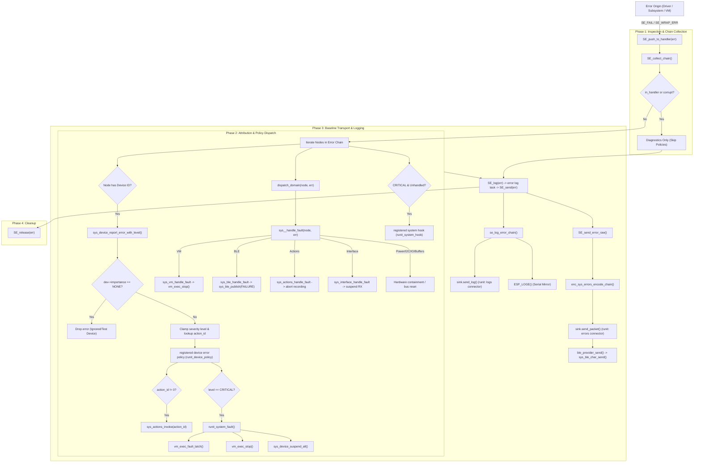
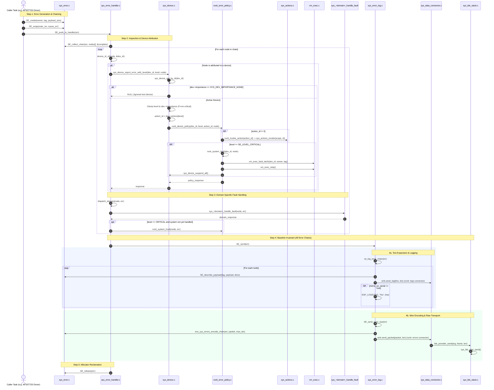

# System errors

Update this document when changing the error core, dispatcher, or tag maps.

## Pipeline and ownership

Errors are typed nodes linked through `next_cause`. `NULL` means success.
`SE_ERR_NEW` creates an owned node; `SE_WRAP_ERR` transfers ownership of its cause
into the new chain. Explicit-owner variants use the same allocator/constructors.
Do not share a cause between two owned chains.

```text
create -> wrap while returning -> SE_REPORT / SE_push_to_handler
       -> validate -> outermost node through causes -> diagnostics -> release
```

`SE_push_to_handler` **consumes** its argument, including when reporting is
suspended. Do not inspect, return, or release that handle afterwards.

- **Responses run synchronously** in the reporting task (device policy, domain hooks,
  system fault), so a response happens before anything else can build on the
  unhandled error.
- **Logging and telemetry run later** in the error log task: `SE_log(chain)` queues
  the chain (consumes it), and that task logs, encodes, sends and releases it. The
  ~1.5 KB of format/encode buffers live on that task's stack, not on the stack of
  every task that raises errors.
- **Queue full:** a chain that finds the queue full (`CONFIG_SYS_ERRORS_LOG_QUEUE_LEN`,
  default 4) is released and counted, and the count is logged.
- **Waiting chains keep their pool nodes,** so keep the queue short.

`SE_send`, the encoder, logging functions, and policy hooks **borrow** their input.
They do not retain it. Their non-NULL return is a separate owned failure.
Use `SE_release(error)` after inspecting/discarding an error yourself.
`SE_IS_OK` / `SE_IS_ERR` only compare; they do not release an error.

```c
err_h error = operation();
if (error) {
  SE_log(error);             // diagnostics only (queued, consumed); or return error to the caller
}
// At an origin with no further use of the error:
SE_REPORT(operation());
```

## Storage and validation

The shared pool is 1,024 bytes: 32 blocks of 32 bytes, reserved with a 32-bit atomic
bitmap. A node occupies consecutive blocks. A 32-byte start-length table validates
node boundaries and complete tag-sized payloads. Tracking costs 36 bytes. There is
no heap allocation and live nodes are never overwritten. Payloads and nodes remain
8-byte aligned. Maximum concurrent capacity depends on payload sizes (up to 32
small nodes); synchronous handling does not eliminate overlapping producer tasks.

`SE_alloc_bytes` validates tag and exact payload size and returns NULL on exhaustion.
Prefer the constructors: a failed new error returns an immutable
`ERR_BASE_POOL_EXHAUSTED` node. It is LOW severity on purpose: a burst of errors
must not trigger the safe state. Pool size: `SYS_ERRORS_BUF_SIZE / SYS_ERRORS_BLOCK_SIZE`
must be at most 32 blocks (one `uint32_t` bitmap, checked at compile time); a failed wrap preserves its existing cause, omitting the new context. Never
mutate the exhaustion node. Long-lived errors consume pool capacity until released.
The pool can exhaust without corrupting another chain; it does not guarantee that
all context can be retained during an error storm.

`SE_collect_chain` returns at most `SE_MAX_CHAIN_DEPTH` (16) unique validated nodes,
outermost first, plus a completeness flag. Handler, logger, encoder and root lookup
share this traversal. Cycles, invalid pointers and longer chains terminate safely.
Malformed/incomplete chains are diagnostic-only. `SE_release` frees the complete
pool-backed chain (also beyond the traversal limit) with bounded cycle detection.
Raw pointers are not generation handles: using a handle after consumption/release
remains invalid, even if its address is later allocated again.

## Dispatch policy

- Device attribution uses the tag payload, independently of the reporting owner.
  Device tags, IO pin tags and power-budget tags identify device instances.
  Contract boundaries wrap failures with the affected device ID.
- Visit outermost node to root cause. For a repeated device, use the highest local
  severity among its mentions before the first ignored-device boundary. Run that
  device's policy once, at its first occurrence; pass the node supplying that level.
  The leaf does not silently replace another node's severity.
- Importance NONE stops handling that device and all deeper causes. Earlier
  responses remain in effect; the full chain still goes to diagnostics. To suppress
  an entire incident, the ignored-device context must precede any actionable nodes.
- Noncritical response levels are capped by importance. Critical bypasses that cap
  for enabled devices; NONE still disables it. Tag severities themselves are unchanged.
- Domain hooks receive `(node, full_chain)` for each visited node in that domain.
  Hooks are registered at boot (`SE_register_domain_hook(domain, fn)`, a table of
  `CONFIG_SYS_ERRORS_MAX_DOMAIN_HOOKS`); a domain without one is skipped. The device
  router (`SE_register_device_router`) and the system hook (`SE_register_system_hook`)
  are registered the same way. runit does all of it in `runit_error_wiring_init()`,
  the first boot step after `SE_init()`.
- Unattributed critical errors (where no device in the chain was attributed,
  `handled == 0`) use the registered system hook, never a lookup of device zero.
  The application latches the triggering node and performs global stop/suspend
  once per latch episode. Enabled devices still run their individual actions
  after the global latch has been set. The dispatcher deduplicates devices
  per incident, not across separate incidents.
- Response failures are diagnostics-only and released after sending. A per-task
  handler guard prevents callbacks/actions re-entering policy while handling an
  incident. Hooks must return new owned failures, never the borrowed input chain.

`SE_suspend` / `SE_resume` are nested and task-local. Suppression in one task does
not drop unrelated errors from another task. The synchronous dispatch/logging API
is for task context; it can invoke actions, transport callbacks and VM barriers.

## Logging and telemetry

`SE_set_logging(level, mirror_serial, trace_errors)` controls text logging and the
ESP log interceptor. `sys_errors` knows no transport: output goes to a sink the
application binds at boot with `SE_register_sink(&(sys_error_sink_t){send_log,
send_packet, packet_max_len})`. runit (`runit_board_error_sink_init`) sends text
lines to the logs connector and binary error packets to the errors connector.
`packet_max_len` is a function asked before every packet, because the transport
limit changes at runtime (runit returns `sys_data_connector_max_payload()` of the
errors connector, which follows the BLE MTU); the encoder packs as many chain
nodes as fit. Unbound outputs are dropped; serial mirroring
still works. Binary errors go out independently of text tracing. The encoder is
private to this component (`enc_sys_errors.h`). The disconnected `sys_error_config` API was removed.
`SE_send` does not acknowledge delivery: the sink's send functions are void, and
runit releases a failed connector send there (reporting it would recurse into the sink).
Its returned error describes encoding failure. Log recursion guards are task-local.

The binary format (no version field; formats aren't versioned before release):

```text
u8 node_count | u8 depth | u32 schema_id LE
repeated: u8 payload_length | u16 tag LE | u16 owner LE | payload bytes
```

- **Tag IDs are explicit and stable:** `X(tag, id, level, struct)`. The high byte is
  the module's owner domain (`0xA3xx` IO, `0xA1xx` devices, and so on), and `0x00xx` holds
  the shared base tags; 0 means "no tag".
- **Adding a tag doesn't renumber the others,** so a client's tag table stays valid
  for existing tags. Duplicate IDs fail the build (duplicate `case` in
  `SE_get_tag_name`).

`depth > node_count` indicates packet-capacity truncation. Depth 255 means corrupt
or over-depth input (the exact length is unknown). The schema ID is FNV-1a over
the tags' NUL-terminated names, IDs and payload sizes in map order. It detects
added tags and payload-size changes; with stable IDs a client can still decode
the tags it knows when the schema differs. A same-size payload-layout
change isn't detected by the schema ID; the client's tables must be regenerated with it. Payloads retain native C alignment
and padding; scalar record headers are explicitly little endian.

Formatted logs still supply human-readable descriptions. Clients with a
matching schema may decode typed payloads.

## Error maps and aggregation

Each module declares its own errors in one header, `sys_error_<module>.h`, kept in the module's **`errors/` folder**:

- `SYS_ERROR_<MODULE>_MAP(X)`: tags as `X(tag, id, level, struct)`: stable ID in the module's domain (`0xDDnn`), default severity (`se_level_e`) and payload struct;
- `SYS_<MODULE>_OWNER_MAP(X)`: owners, whose high byte (`owner & 0xFF00`) is the module's domain;
- `SYS_ERROR_<MODULE>_LOGGER_MAP(X)` plus `LOG_BODY_*`: optional readable payload descriptions.

`codes/sys_error_codes.h` includes every map and combines them into `SYS_ERROR_MAP` / `SYS_OWNER_MAP`, which generate the tag and owner enums, payload types, names and logger dispatch in `sys_error.h`.

| Module | Map | Domain |
|---|---|---|
| `sys_device` | `system/sys_device/errors/sys_error_dev.h` | `0xA1` |
| `sys_i2c` | `system/sys_i2c/errors/sys_error_i2c.h` | `0xA2` |
| `sys_io` | `system/sys_io/errors/sys_error_io.h` | `0xA3` |
| `sys_power` | `system/sys_power/errors/sys_error_power.h` | `0xA4` |
| `ble` | `system/ble/errors/sys_error_ble.h` | `0xA5` |
| `sys_interface` + decoders | `system/sys_interface/errors/sys_error_interface.h` | `0xA6` |
| `sys_buffers` | `system/sys_buffers/errors/sys_error_buffers.h` | `0xA7` |
| `sys_errors` | `codes/sys_error_base.h` | `0xA8` |
| `VM` | `VM/errors/sys_error_vm.h` | `0xA9` |
| `sys_actions` | `system/sys_actions/errors/sys_error_actions.h` | `0xAA` |
| `sys_event` | `system/sys_event/errors/sys_error_event.h` | `0xAB` |
| `sys_hbridge` | `system/sys_hbridge/errors/sys_error_hbridge.h` | `0xAC` |
| `sys_data_connector` | `system/sys_data_connector/errors/sys_error_data_connector.h` | `0xAD` |
| `features` | `features/errors/sys_error_features.h` | `0xAE` |
| `runit` | `runit/errors/sys_error_runit.h` | `0xAF` |
| `sys_settings` | `system/sys_settings/errors/sys_error_settings.h` | `0xB0` |
| devices | `devices/devices/errors/devices_owners.h` | `0xD0` |

**Why include dirs, not `REQUIRES`.** Every module `REQUIRES sys_errors`, so `sys_errors` can't require them back (component cycle). It lists each `errors/` folder as a plain include dir in its `CMakeLists.txt` instead. The maps are pure data (X-macros), not code dependencies, so this is safe.

**Why a separate `errors/` folder.** The include dirs of `sys_errors` are public: every component that includes `sys_error.h` can also include whatever sits in them. If the maps lived in a module's `include/`, that module's whole API would leak to everyone. That once hid a real `ble` → `sys_data_connector` dependency. An `errors/` folder holds only error maps, so nothing else leaks.

**Rules for a map header:**
- Only data: X-macro maps and `LOG_BODY_*` macros.
- No includes beyond `<stdint.h>` / `<stdio.h>`: it's parsed early in the `sys_error.h` include chain, before `err_h` exists.
- A description that needs another module's names forward-declares just those symbols as `extern` (see `sys_error_dev.h`).

**Adding a module's errors:**
1. Create `<component>/errors/sys_error_<module>.h`.
2. Pick an unused domain byte (table above).
3. Include the header in `codes/sys_error_codes.h`, and add its maps to `SYS_ERROR_MAP` / `SYS_OWNER_MAP` / the logger map.
4. Add the folder to `sys_errors/CMakeLists.txt`.
5. Only if the domain gets a fault hook, add it to `dispatch_domain()` in `sys_error_handler.c`.

**Expected build warnings.** ESP-IDF's component check reports each of these folders once ("Include directory … belongs to component X but is being used by component sys_errors"): 16 warnings, one per `errors/` folder. They are expected. Any other project warning is new and must be fixed. Adding a tag changes the schema ID (see "Logging and telemetry"); adding an owner doesn't.

## Files and verification

- `sys_error.c`: pool, release, bounded traversal, metadata.
- `sys_error_handler.c`: synchronous policy dispatch.
- `sys_error_log.c`: ESP logging hook, formatting, sink send.
- `enc_sys_errors.h`: private binary chain encoder.
- `include/sys_error.h`: constructors and ownership API.
- `include/sys_error_hooks.h`: optional domain hooks.
- `codes/sys_error_codes.h`: aggregate module tag/owner/logger maps (from each module's `errors/` folder, see above).

There is no test target: the host test (`tools/tests/test_sys_errors.py`) and the
firmware self-tests were removed in commit `47207d3`.

## Error Lifecycle & Call Tree Architecture

### 1. High-Level Flowchart



### 2. Detailed Sequence & Call Tree Diagram



### 3. Component Symbol & Call Reference Map

| Component / Step | Source File | Key Symbols / Functions |
| :--- | :--- | :--- |
| **Error Allocation & Chaining** | `sys_error.c` | `SE_create()`, `SE_wrap()`, `SE_collect_chain()`, `SE_release()` |
| **Handler & Central Dispatch** | `sys_error_handler.c` | `SE_push_to_handler()`, `device_id_of()`, `dispatch_domain()` |
| **Device Error Routing** | `components/system/sys_device/sys_device.c` | `sys_device_report_error_with_level()`, `sys_device_report_error()`, `sys_device_suspend_all()` |
| **App Coordinator Policy** | `components/runit/runit_error_policy.c` | `runit_error_wiring_init()`, `runit_device_policy()`, `runit_system_hook()`, `runit_system_fault()`, `runit_invoke_action()` |
| **Action Execution** | `components/system/sys_actions/sys_actions.c` | `sys_actions_invoke()` |
| **VM Fault Containment** | `components/VM/core/exec/vm_exec.c` | `vm_exec_fault_latch()`, `vm_exec_stop()`, `sys_vm_handle_fault()` |
| **Logging & Wire Telemetry** | `sys_error_log.c` | `SE_log()` (queue), error log task, `SE_send()`, `se_log_error_chain()`, `SE_send_error_raw()` |
| **Output Sink Binding** | `components/runit/runit_board_cfg.c` | `runit_board_error_sink_init()` → `SE_register_sink()` |
| **Bus Switchboard** | `components/system/sys_data_connector/sys_data_connector.c` | `sys_data_connector_send()` |

