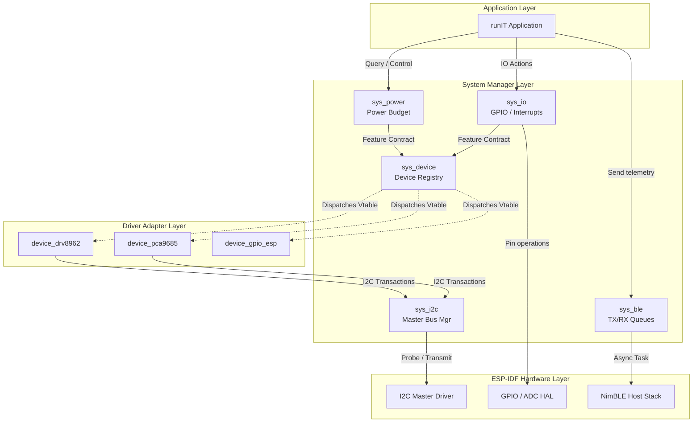

# System Architecture & Submodules (system)

IMPORTANT: If you add, modify, or delete system submodules, you must update this master documentation to reflect the structural changes.

## Overview
The `system` component serves as the central hardware abstraction layer (HAL) and operating infrastructure for the runIT firmware. It translates generic system interface requests (e.g. "turn on voltage regulator", "toggle pin 10", "transmit packet") into driver-specific actions while maintaining unified state machines, thread safety, and safety limits.

### Directory Map
```
components/system/
├── SYSTEM.MD             # This master architecture documentation
├── ble/                  # BLE Manager & NimBLE host abstraction
│   └── SYS_BLE.MD        # BLE manager documentation
├── error_handler/        # System-wide diagnostics & event handlers
├── sys_device/           # Polymorphic central device registry
│   └── SYS_DEVICE.MD     # Device manager documentation
├── sys_i2c/              # Physical I2C master bus routing & transactions
│   └── SYS_I2C.MD        # I2C manager documentation
├── sys_interface/        # Command binding and external communications
├── sys_io/               # Pin configuration, interrupts, and ADC inputs
│   └── SYS_IO.MD         # I/O manager documentation
└── sys_power/            # Telemetry, regulators, USB-PD, and safety budget
    └── SYS_POWER.MD      # Power manager documentation
```

---

## Architecture & Data Flow

The diagram below illustrates how submodules in the `system` component isolate the high-level application code from the low-level physical device drivers and ESP-IDF stack.



---

## Submodule Overview

### 1. Central Device Manager ([sys_device](file:///c:/Users/krolp/Documents/runIT_main/_SOFTWARE/components/system/sys_device/SYS_DEVICE.MD))
Acts as the central registry for all hardware modules present on the board.
* **Polymorphism**: Binds context handles and pointers to specific feature contracts (`contracts` vtables).
* **Contracts Supported**:
  * `0`: I/O (`sys_io_vtable_t`)
  * `1`: VREG (Voltage Regulator)
  * `2`: Power Monitor (Telemetry)
  * `3`: USB-PD (USB Power Delivery)

### 2. I/O Manager ([sys_io](file:///c:/Users/krolp/Documents/runIT_main/_SOFTWARE/components/system/sys_io/SYS_IO.MD))
Coordinates physical and expanded pin states.
* **Abstract Addressing**: Translates high-level device ID and pin index offsets (e.g. ESP GPIO vs. TCA6424A expander pins) dynamically.
* **Interrupt Routing**: Handles ISR configurations (ADC threshold window events and edge-trigger events).

### 3. Power Manager ([sys_power](file:///c:/Users/krolp/Documents/runIT_main/_SOFTWARE/components/system/sys_power/SYS_POWER.MD))
Implements safety boundaries and telemetry collection.
* **Power Budget Allocation**: Protects circuits against brownouts by tracking and limiting total regulator power allocation (`allocated_mW`).
* **Safety Thresholds**: Lockable write-once configuration thresholds set at startup.

### 4. I2C Bus Manager ([sys_i2c](file:///c:/Users/krolp/Documents/runIT_main/_SOFTWARE/components/system/sys_i2c/SYS_I2C.MD))
Coordinates shared communication buses (Bus 0 for internal circuits, Bus 1 for external ports).
* **Fault Tolerance**: Automatic retries on timeout or response errors during read/write restart sequences.
* **Polymorphic Device Registry**: Automatically sets transmission callbacks (`transmit` and `transmit_receive`) on target drivers.

### 5. BLE Asynchronous Manager ([sys_ble](file:///c:/Users/krolp/Documents/runIT_main/_SOFTWARE/components/system/ble/SYS_BLE.MD))
Encapsulates NimBLE configurations.
* **Non-Blocking Sends**: Queues outgoing indications/notifications into priority TX slots.
* **Event Notifications**: Dequeues incoming GATT writes into RX ring buffers, waking client worker threads via semaphores.

### 6. Error & Status Logger ([error_handler](file:///c:/Users/krolp/Documents/runIT_main/_SOFTWARE/components/system/error_handler/))
Central endpoint for catching warnings and critical diagnostics.
* Logs `status_rep_t` events.
* Coordinates safety overrides and fallback modes when hardware protections trigger.
